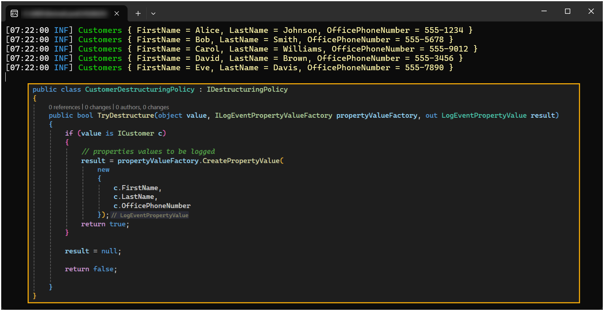

# Structured Data: 

[Customizing the stored data](https://github.com/serilog/serilog/wiki/Structured-Data#customizing-the-stored-data)


This project demonstrates how to use destructuring to hide information using the Serilog `@` destructuring operator for security or to eliminate unnecessary data when logging to the console or a file.

## How to

1. Create a class which implements `IDestructuringPolicy`.
1. In `TryDestructure` write logic to provide the destructured object.
    1. In `CreatePropertyValue` write logic to provide which properties will be displayed when Serilog `@` destructuring operator is used on a given object.


## Program.cs 

```csharp
public class Program
{
    public static void Main(string[] args)
    {
        var builder = WebApplication.CreateBuilder(args);

        Log.Logger = new LoggerConfiguration()
            .Destructure.With(new CustomerDestructuringPolicy())
            .MinimumLevel.Override("Microsoft", Serilog.Events.LogEventLevel.Warning)
            .MinimumLevel.Override("System", Serilog.Events.LogEventLevel.Warning)
            .MinimumLevel.Information()
            .WriteTo.Console()
            .CreateLogger();

        builder.Host.UseSerilog();
```

